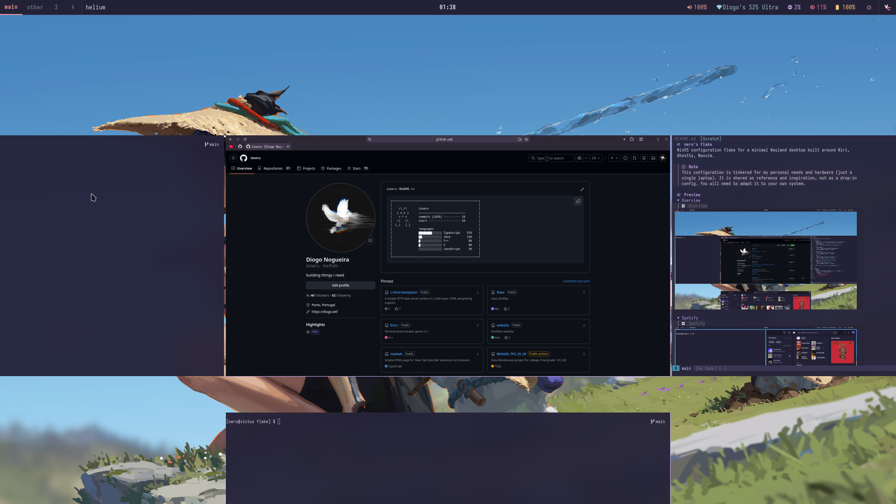
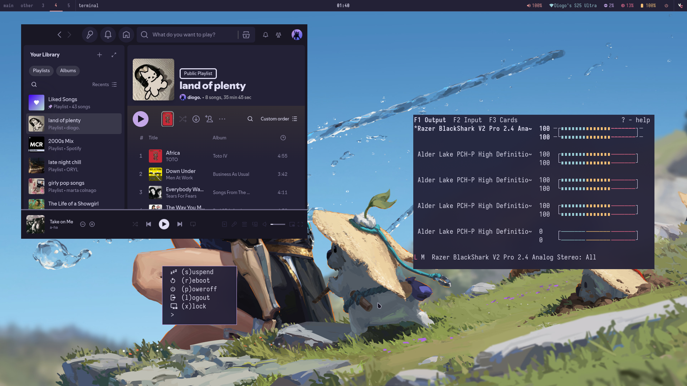
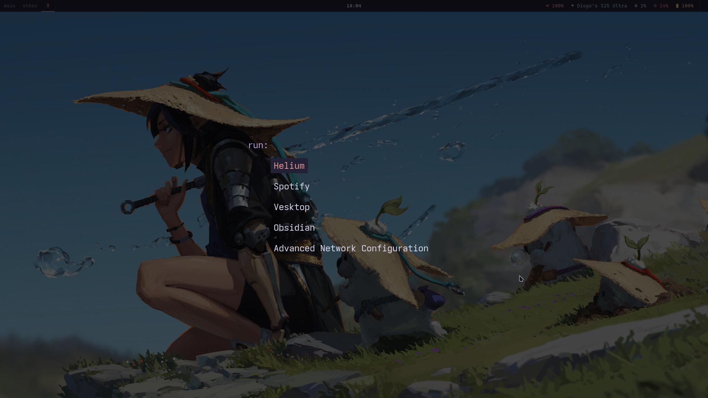
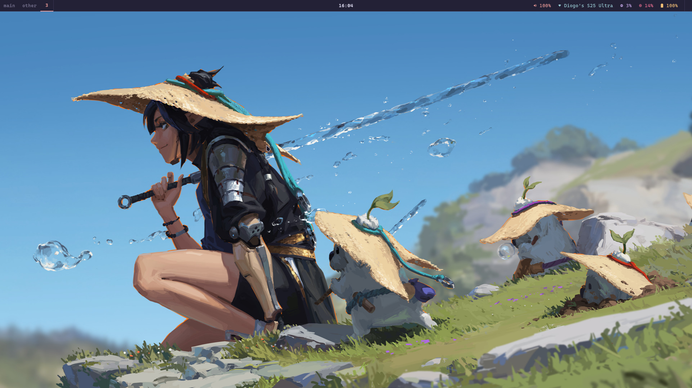

# neru's flake

NixOS configuration flake for a minimal Wayland desktop built around Niri, Ghostty, Neovim.

> [!NOTE]
> This configuration is tinkered for my personal needs and hardware (just a single laptop). It is shared as reference and inspiration, not as a drop-in config. You will need to adapt it to your own system.

## Preview

<details>
<summary>Overview</summary>


</details>

<details>
<summary>Spotify</summary>


</details>

<details>
<summary>Tofi</summary>


</details>

<details>
<summary>Wallpaper and waybar</summary>


</details>

## What's inside

| Layer | Component |
|-------|-----------|
| Window Manager | Niri (Wayland) |
| Terminal | Ghostty |
| Shell | Zsh + Oh My Zsh + Starship |
| Editor | Neovim (LSP, Telescope, Tree-sitter) |
| Multiplexer | Tmux (sessionx, resurrect) |
| Status Bar | Waybar |
| App Launcher | Tofi |
| Music | Spotify + Spicetify |
| File Manager | Thunar |
| PDF Viewer | Zathura |

Colors, fonts, and theme settings are centralized into a **`style.nix`** file. 

## Installation

1. Install [NixOS](https://nixos.org/download/) and boot into a minimal environment.

2. Clone this repo:
   ```sh
   git clone https://github.com/isneru/flake ~/flake
   ```

3. Replace the hardware configuration with your own:
   ```sh
   cp /etc/nixos/hardware-configuration.nix ~/flake/hosts/victus/hardware.nix
   ```

4. Build and switch:
   ```sh
   cd ~/flake
   git add -A
   just switch
   ```

   Or without `just`:
   ```sh
   nixos-rebuild switch --flake ~/flake
   ```

## Dependencies

### External fonts

The following fallback fonts are installed via Nix:
- IosevkaTerm Nerd Font
- CaskaydiaCove Nerd Font
- JetBrains Mono Nerd Font
- Geist Mono Nerd Font
- Fira Code Nerd Font

### Flake inputs

| Input | Purpose |
|-------|---------|
| [`flake-parts`](https://github.com/hercules-ci/flake-parts) | Flake organization |
| [`home-manager`](https://github.com/nix-community/home-manager) | User environment management |
| [`lanzaboote`](https://github.com/nix-community/lanzaboote) | Secure Boot |
| [`niri`](https://github.com/YaLTeR/niri) | Niri window manager |
| [`nixpkgs`](https://github.com/nixos/nixpkgs) | Packages and NixOS modules |
| [`sops-nix`](https://github.com/Mic92/sops-nix) | Secrets management |
| [`spicetify`](https://github.com/Gerg-L/spicetify-nix) | Spotify theming |

## Structure

```
flake/
├── flake.nix              # Entrypoint and inputs
├── parts/                 # Flake-parts modules (formatter, nixos)
├── hosts/victus/          # Host-specific config (hardware, boot, desktop)
├── home/neru/
│   ├── style.nix          # Centralized (fonts, colors) styles config
│   ├── theme.nix          # GTK/Qt/cursor theming
│   ├── cli.nix            # Shell, zoxide, zathura
│   ├── packages.nix       # System-wide packages
│   └── config/
│       ├── ghostty/       # Terminal
│       ├── mako/          # Notification Daemon
│       ├── niri/          # Window manager
│       ├── nvim/          # Neovim (LSP, plugins, theme)
│       ├── spotify/       # Spicetify
│       ├── starship/      # Shell prompt
│       ├── tmux/          # Tmux + plugins
│       ├── tofi/          # App launcher
│       ├── vesktop/       # Discord client
│       ├── waybar/        # Status bar
│       └── yazi/          # TUI file manager
└── secrets/               # Encrypted secrets (sops)
```
