# flake

NixOS + Home Manager configuration for `victus`, structured as a **dendritic
flake-parts tree**: every `.nix` file under `modules/` is a self-contained,
self-registering module, auto-discovered by `import-tree` - there's no manual
`imports = [ ... ]` list anywhere in `modules/`. A feature that spans both
layers (e.g. Hyprland: compositor enable at the NixOS level, config +
theme registration at the Home Manager level) declares both in one file
instead of being split across a system/user directory boundary.

Hyprland under UWSM, SDDM wearing the same notch face as the lock screen, and
a Quickshell shell that draws a macOS-style notch and owns the desktop's
notifications, lock screen, polkit prompts, credential prompts, screen-share
picker and tray. The Omen key swaps all of it for a **bare mode** - one status
line at the bottom, square windows, no animation, and a themed `wmenu` wherever
the notch would open a panel. Colours are runtime, not build-time:
`theme-set <name>` repaints almost everything without a rebuild.

## Showcase

The pill sits at the top centre, with rounded screen corners so the display
reads as if its bezel were curved. It collapses to a clock and hides itself
entirely when a window goes fullscreen.

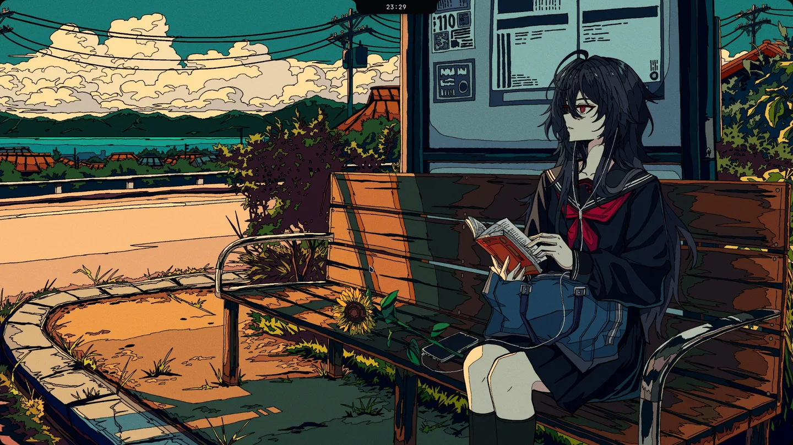

Hovering peeks: the pill widens into workspace dots, the clock, an alert count
and any exception icons (muted, do-not-disturb, night light, mic in use), then
settles back when the pointer leaves.

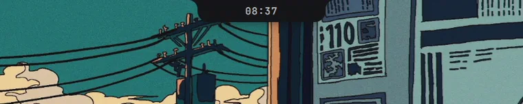

Clicking it opens the dashboard, which morphs out of the pill rather than
appearing over it.

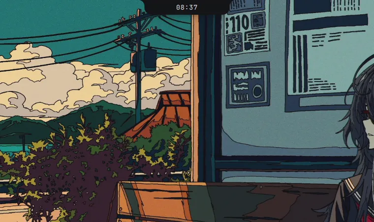

Everything below is collapsed - open a section to see it.

<details>
<summary><b>The seven tabs</b> &nbsp;·&nbsp; Home, Media, Control, Alerts, Calendar, Workspaces, Tools</summary>

<br/>

<table>
  <tr>
    <td width="50%"><a href="assets/home.webp">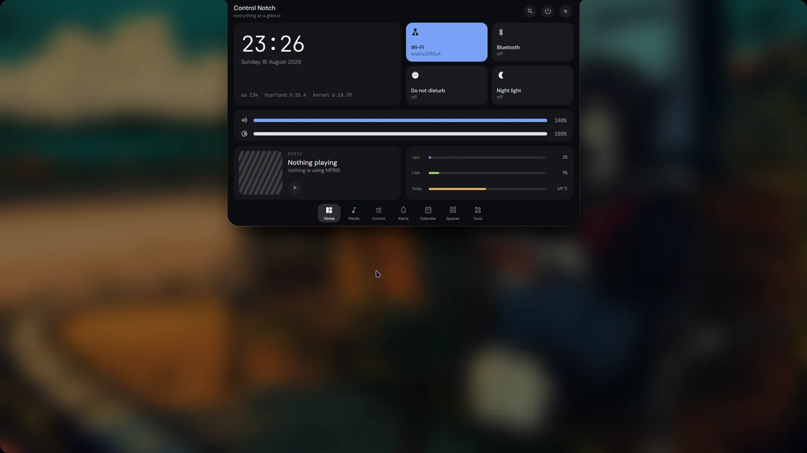</a></td>
    <td width="50%"><a href="assets/media.webp"></a></td>
  </tr>
  <tr>
    <td><b>Home</b><br/>The overview - clock, uptime, the two connectivity tiles, quick toggles, volume and brightness, playback, and live CPU/RAM/temperature.</td>
    <td><b>Media</b><br/>MPRIS: artwork, scrubber, transport, loop and shuffle, output device, and a source list of every registered player. The player that started first keeps the widget, so an autoplaying video can't steal it; click a source to pin it instead.</td>
  </tr>
  <tr>
    <td width="50%"><a href="assets/control.webp">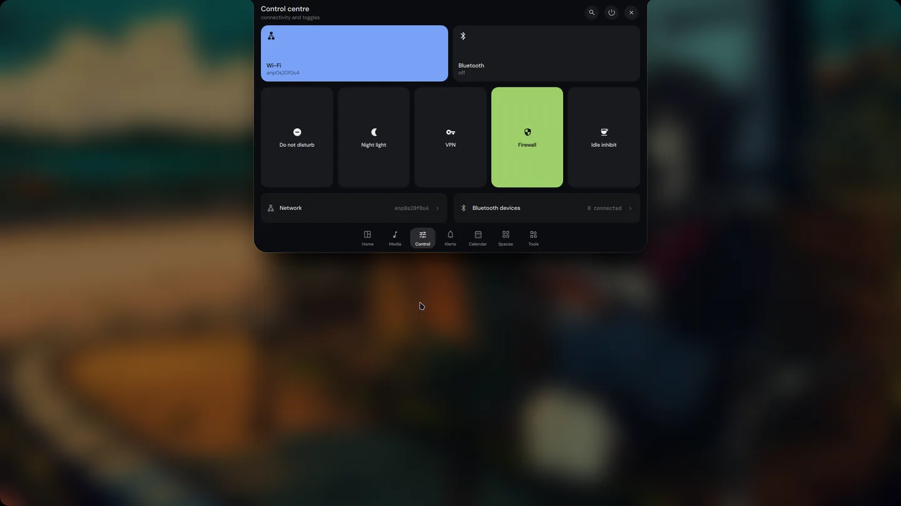</a></td>
    <td width="50%"><a href="assets/notifications.webp"></a></td>
  </tr>
  <tr>
    <td><b>Control centre</b><br/>A hierarchy - Wi-Fi and Bluetooth keep full tiles because they carry status, the other five toggles are compact, and the network and Bluetooth detail rows sit at the bottom.</td>
    <td><b>Alerts</b><br/>The notification centre: do-not-disturb, per-notification actions, dedup counts, and a history persisted across restarts.</td>
  </tr>
  <tr>
    <td width="50%"><a href="assets/calendar.webp">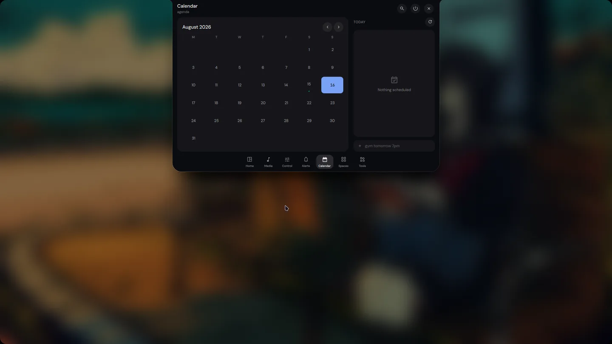</a></td>
    <td width="50%"><a href="assets/workspaces.webp">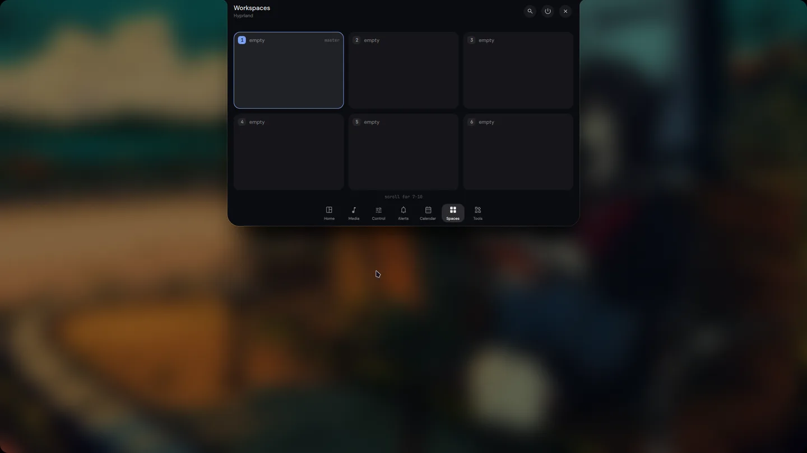</a></td>
  </tr>
  <tr>
    <td><b>Calendar</b><br/>The month, plus the agenda synced from Google Calendar.</td>
    <td><b>Workspaces</b><br/>Mirrors Hyprland's state, with each window listed under its space.</td>
  </tr>
  <tr>
    <td width="50%"><a href="assets/tools.webp"></a></td>
    <td width="50%"></td>
  </tr>
  <tr>
    <td><b>Tools</b><br/>The second level: eleven tiles in two captioned groups.</td>
    <td></td>
  </tr>
</table>

</details>

<details>
<summary><b>Utilities</b> &nbsp;·&nbsp; clipboard, shelf, QR, timer, weather</summary>

<br/>

<table>
  <tr>
    <td width="50%"><a href="assets/clipboard.webp">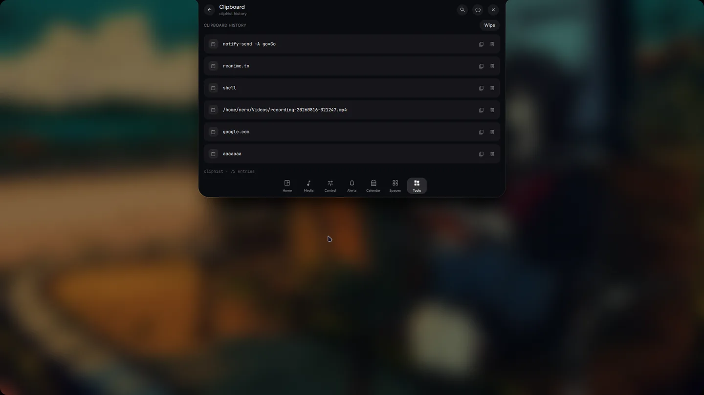</a></td>
    <td width="50%"><a href="assets/shelf.webp">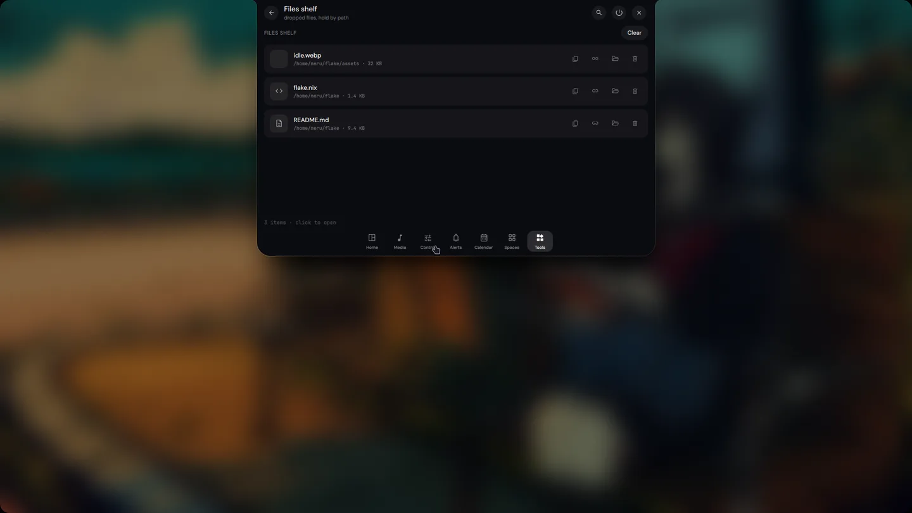</a></td>
  </tr>
  <tr>
    <td><b>Clipboard</b><br/><code>cliphist</code> history, searchable, with copy and delete per entry.</td>
    <td><b>Files shelf</b><br/>Holds dropped files <b>by path</b> - nothing is ever copied. Drag onto the notch to add.</td>
  </tr>
  <tr>
    <td width="50%"><a href="assets/qr-scanner.webp">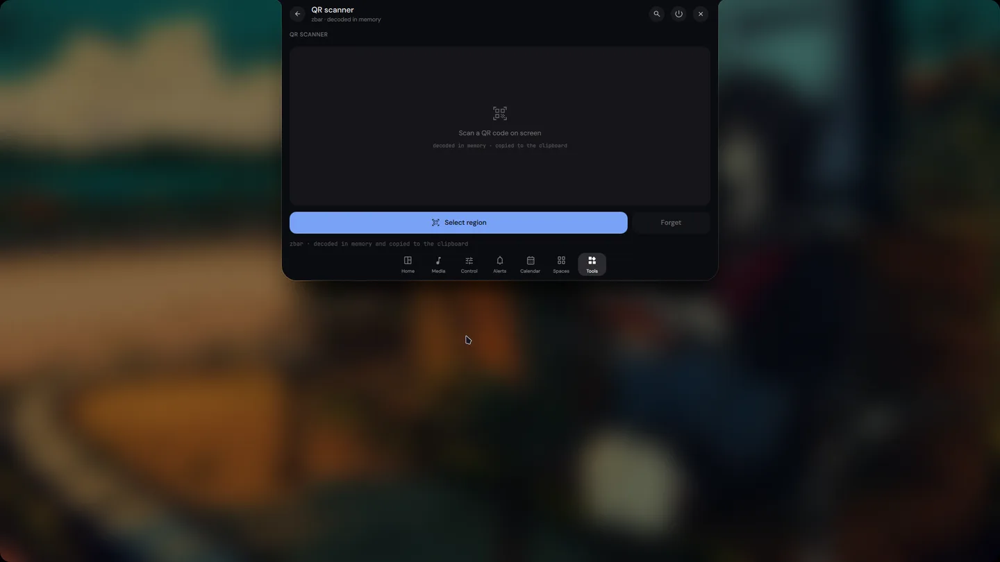</a></td>
    <td width="50%"><a href="assets/timer.webp">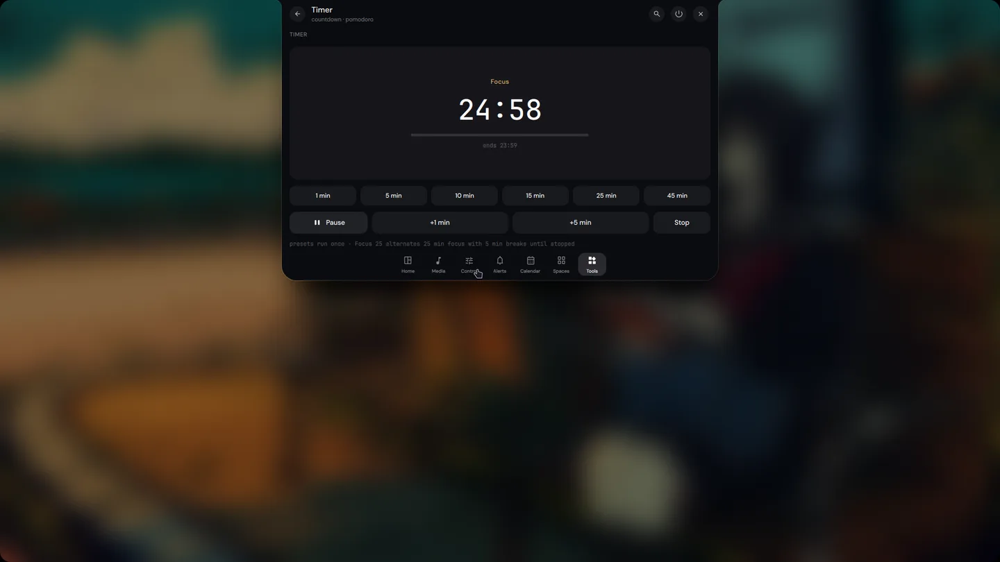</a></td>
  </tr>
  <tr>
    <td><b>QR scanner</b><br/>Pipes a selected region straight into zbar - no image touches disk, and the result is copied for you.</td>
    <td><b>Timer</b><br/>Countdown and pomodoro. Survives a shell reload, because it stores a deadline rather than a remaining time.</td>
  </tr>
  <tr>
    <td width="50%"><a href="assets/weather.webp"></a></td>
    <td width="50%"></td>
  </tr>
  <tr>
    <td><b>Weather</b><br/>open-meteo with no API key, against a location geocoded once and pinned in the config.</td>
    <td></td>
  </tr>
</table>

</details>

<details>
<summary><b>System</b> &nbsp;·&nbsp; monitor, displays, audio, network, Bluetooth, appearance</summary>

<br/>

<table>
  <tr>
    <td width="50%"><a href="assets/monitor.webp">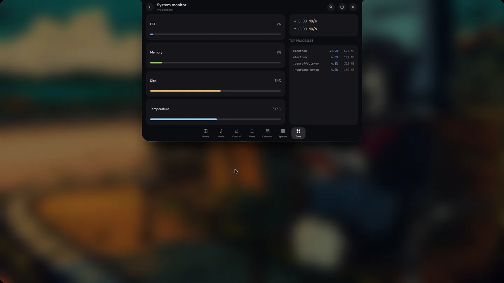</a></td>
    <td width="50%"><a href="assets/displays.webp">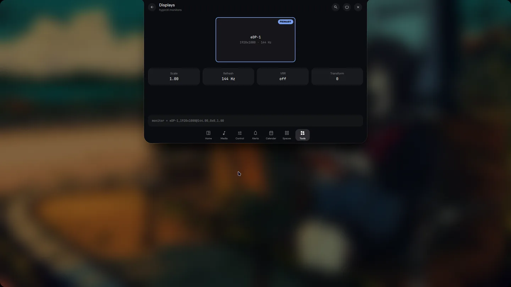</a></td>
  </tr>
  <tr>
    <td><b>System monitor</b><br/>Live sensors and the top processes.</td>
    <td><b>Displays</b><br/>Everything <code>hyprctl monitors</code> reports, per output.</td>
  </tr>
  <tr>
    <td width="50%"><a href="assets/audio.webp">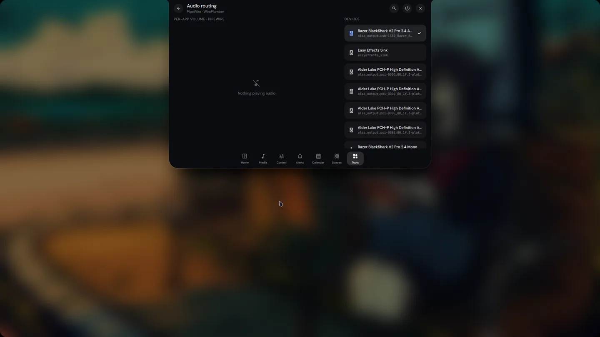</a></td>
    <td width="50%"><a href="assets/bluetooth.webp">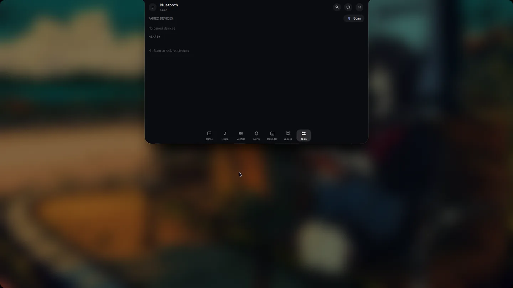</a></td>
  </tr>
  <tr>
    <td><b>Audio routing</b><br/>PipeWire sinks and sources, with per-app volume.</td>
    <td><b>Bluetooth</b><br/>bluez: paired devices, scanning, and battery where the device reports it.</td>
  </tr>
  <tr>
    <td width="50%"><a href="assets/network-wifi.webp">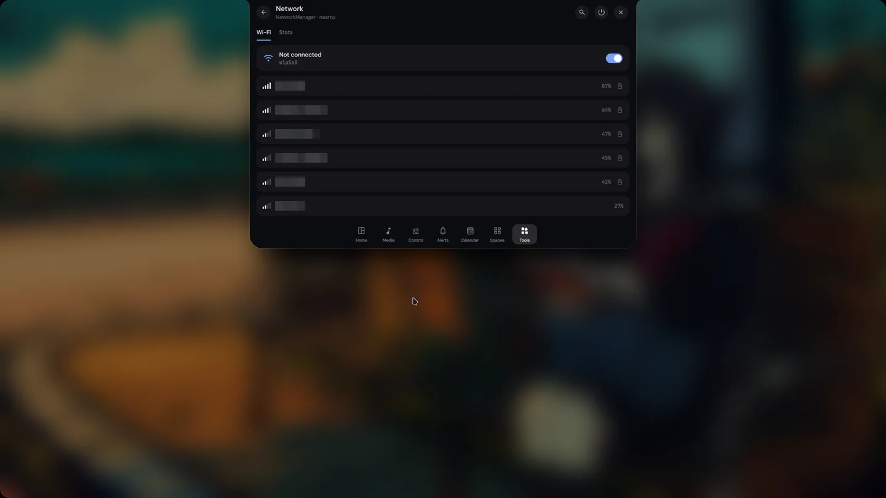</a></td>
    <td width="50%"><a href="assets/network-stats.webp">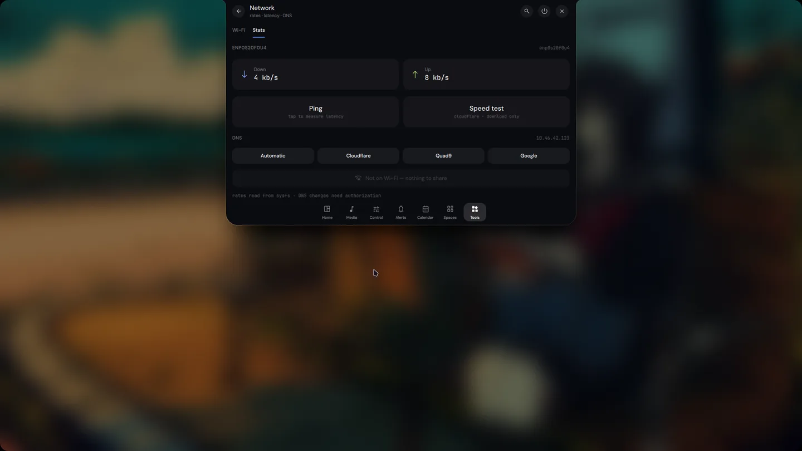</a></td>
  </tr>
  <tr>
    <td><b>Wi-Fi</b><br/>NetworkManager's nearby list. Neighbours' SSIDs are pixelated here, not in the shell.</td>
    <td><b>Network stats</b><br/>Live rates read straight from <code>/proc</code>, ping, a curl-based speed test, DNS presets, and Wi-Fi QR export.</td>
  </tr>
  <tr>
    <td width="50%"><a href="assets/wallpaper.webp">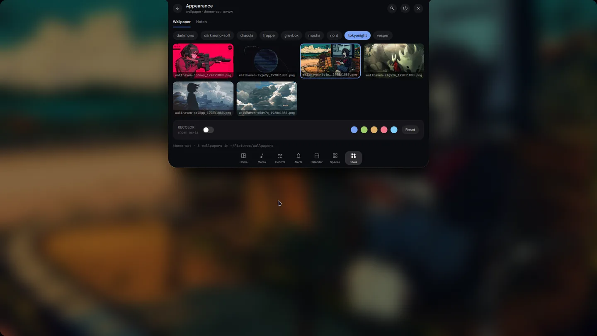</a></td>
    <td width="50%"><a href="assets/appearance.webp">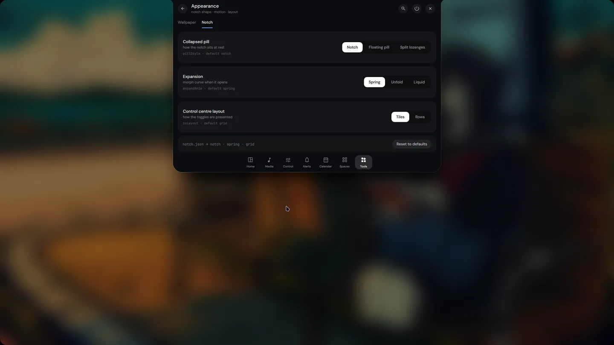</a></td>
  </tr>
  <tr>
    <td><b>Wallpaper &amp; theme</b><br/>The wallpaper grid that drives the runtime theme engine, plus the recolour toggle; the Themes tab beside it previews every palette in its own colours.</td>
    <td><b>Appearance</b><br/>The notch's own shape, morph curve and Control-centre layout.</td>
  </tr>
</table>

</details>

<details>
<summary><b>Elsewhere in the shell</b> &nbsp;·&nbsp; launcher, power, tray, polkit, screen share, OSDs, edge tabs</summary>

<br/>

<table>
  <tr>
    <td width="50%"><a href="assets/launcher.webp">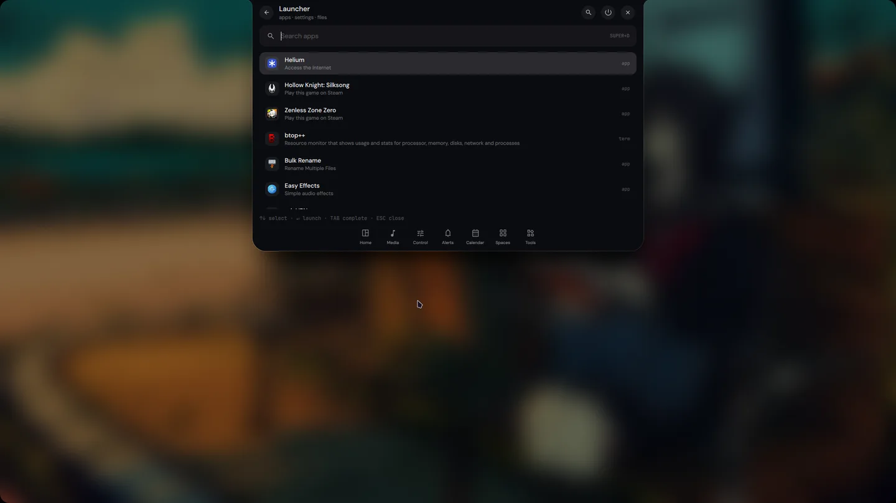</a></td>
    <td width="50%"><a href="assets/power.webp">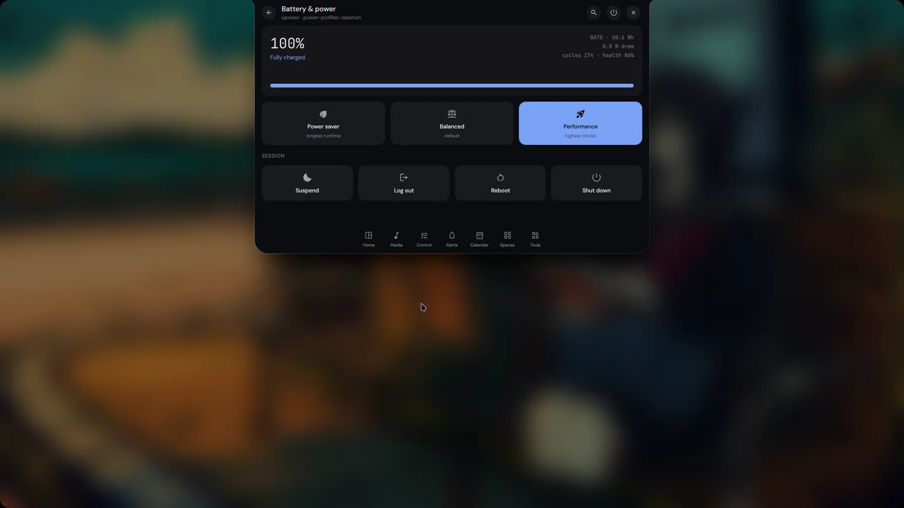</a></td>
  </tr>
  <tr>
    <td><b>Launcher</b><br/>Ranks by how often you actually launch something, keeping match quality first so relevance never loses to popularity.</td>
    <td><b>Battery &amp; power</b><br/>upower and power-profiles-daemon, plus the session actions.</td>
  </tr>
  <tr>
    <td width="50%"><a href="assets/tray.webp">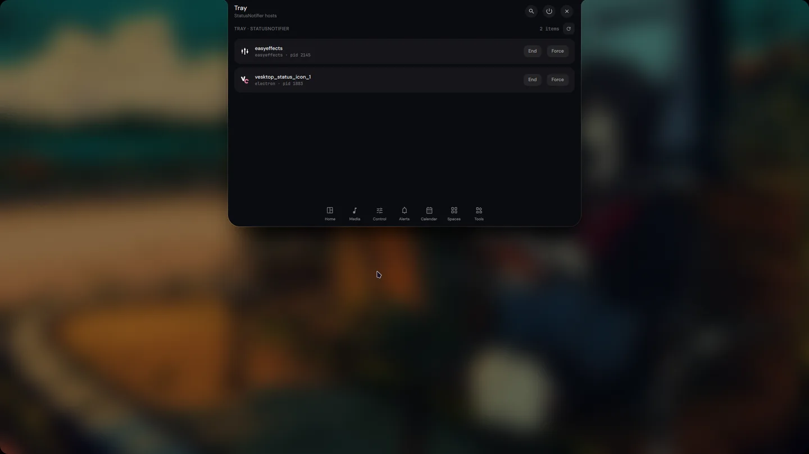</a></td>
    <td width="50%"><a href="assets/authorize.webp">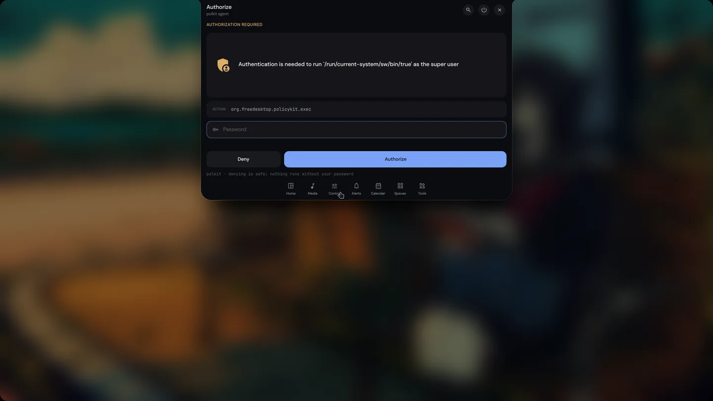</a></td>
  </tr>
  <tr>
    <td><b>Tray</b><br/>The process behind each StatusNotifier item, where an unresponsive app can be signalled directly.</td>
    <td><b>Authorize</b><br/>Nothing else was installed as a polkit agent, so the shell is one - prompting next to the raw action id.</td>
  </tr>
  <tr>
    <td width="50%"><a href="assets/screenshare.webp">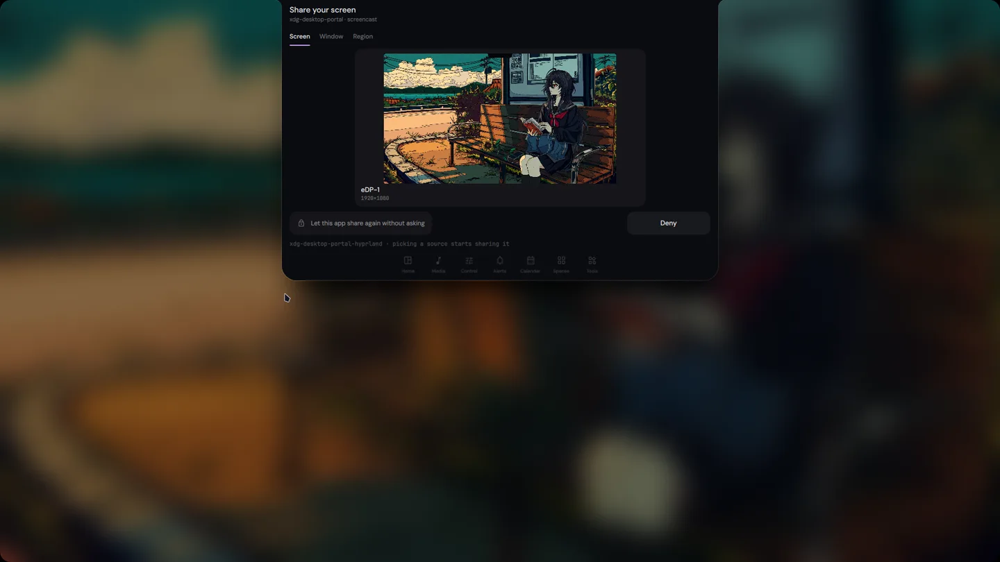</a></td>
    <td width="50%"><a href="assets/screenshare-windows.webp">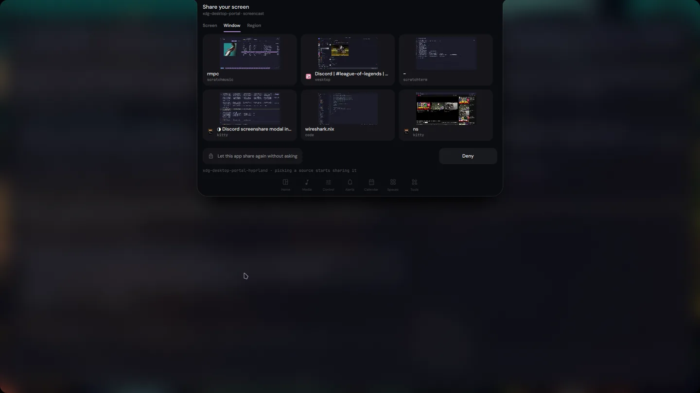</a></td>
  </tr>
  <tr>
    <td><b>Screen share</b><br/>Replaces the portal's own Qt dialog, which showed an empty box where a preview should be. Picking a source shares it - one click, no confirm step.</td>
    <td><b>Screen share, by window</b><br/>Every window as a real thumbnail, captured through the same protocol the share itself uses. Region is the third tab.</td>
  </tr>
  <tr>
    <td width="50%"><a href="assets/edge-tabs.webp">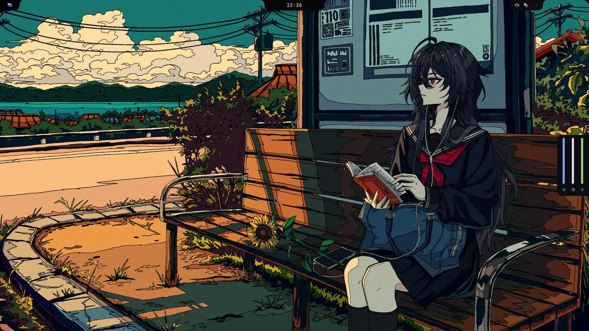</a></td>
    <td width="50%"><a href="assets/peek.webp">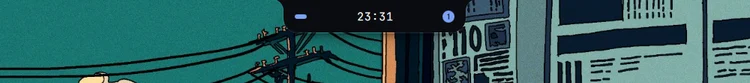</a></td>
  </tr>
  <tr>
    <td><b>Edge tabs</b><br/>Fully invisible until hovered, then sliding out as if the bezel were extending: the tray at the top right, and volume/brightness/mic sliders on the right edge.</td>
    <td><b>Peek</b><br/>The hover row as a still - workspace dots, clock, alert count.</td>
  </tr>
  <tr>
    <td width="50%"><a href="assets/special-corner.webp">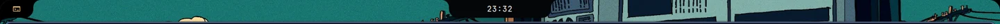</a></td>
    <td width="50%"><a href="assets/osd-notification.webp">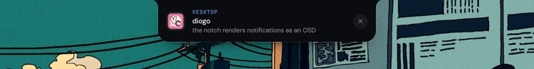</a></td>
  </tr>
  <tr>
    <td><b>Special workspace</b><br/>A scratchpad grows a small tab in the top-left corner carrying its glyph, and nothing else changes.</td>
    <td><b>Notification OSD</b><br/>Drawn in the pill itself. Pauses its countdown while the pointer is on it, so the action buttons are reachable.</td>
  </tr>
  <tr>
    <td width="50%"><a href="assets/osd-volume.webp">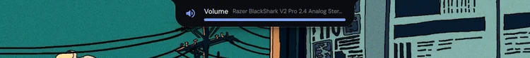</a></td>
    <td width="50%"><a href="assets/osd-brightness.webp">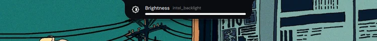</a></td>
  </tr>
  <tr>
    <td><b>Volume OSD</b><br/>With the active sink named.</td>
    <td><b>Brightness OSD</b><br/>With the backlight device named.</td>
  </tr>
</table>

</details>

<details>
<summary><b>Pill styles</b> &nbsp;·&nbsp; inset and split, as runtime settings</summary>

<br/>

The pill's shape is a runtime setting (Tools -> Appearance), and only the
collapsed state differs - <code>inset</code> floats free of the top edge,
<code>split</code> breaks into a clock and a status half. Both resolve into the
same peek and dashboard.

<table>
  <tr>
    <td width="50%"><a href="assets/pill-inset.webp">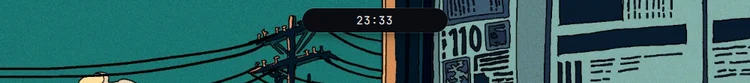</a></td>
    <td width="50%"><a href="assets/pill-split.webp">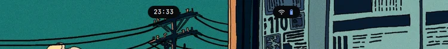</a></td>
  </tr>
  <tr>
    <td><b>Inset</b><br/>A floating pill, detached from the screen edge.</td>
    <td><b>Split</b><br/>Clock and status as two separate pills.</td>
  </tr>
  <tr>
    <td width="50%"><a href="assets/hover-inset.webp">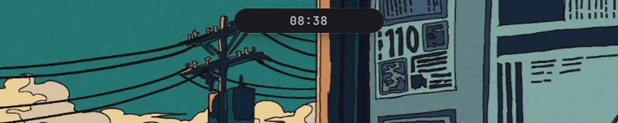</a></td>
    <td width="50%"><a href="assets/hover-split.webp">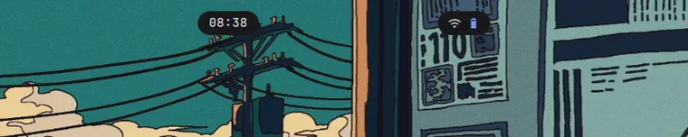</a></td>
  </tr>
  <tr>
    <td><b>Inset, hovered</b></td>
    <td><b>Split, hovered</b> - the two halves merge.</td>
  </tr>
  <tr>
    <td width="50%"><a href="assets/expand-inset.webp">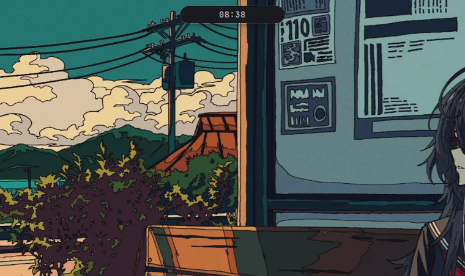</a></td>
    <td width="50%"><a href="assets/expand-split.webp">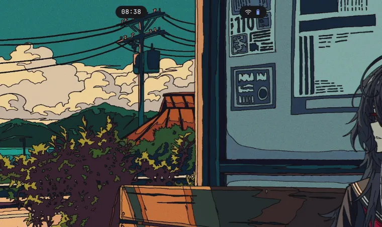</a></td>
  </tr>
  <tr>
    <td><b>Inset, expanding</b></td>
    <td><b>Split, expanding</b></td>
  </tr>
</table>

</details>

## Structure

```
flake.nix                                      # entry point: inputs + flake-parts + import-tree ./modules
lib/
  style.nix                                    # build-time seed palette + fonts (derived from
                                               # themes/mocha.toml), threaded as the `style` module arg
hosts/victus/                                  # host identity + hardware - not a pooled aspect
  default.nix                                  # hostName, networking, users, GPU workarounds
  hardware.nix                                 # nixos-generate-config output
modules/                                       # one directory per aspect: <name>/<name>.nix
                                               # plus whatever files it reads or symlinks
  flake/                                       # the flake's own assembly, not aspects
    system.nix                                 # nixosConfigurations.victus assembly
    checks.nix                                 # theme-render check (see below)
    formatter.nix                              # treefmt (nixfmt, deadnix, stylua, shfmt, keep-sorted)
    apps.nix, lib.nix                          # nix run .#<app> standalone previews
  boot/, locales/, nix/, coredump/, secrets/   # nixos-only aspects
  desktop/                                     # portals, power, bluetooth
  networking/                                  # NetworkManager, BBR, wireshark
  virtualisation/                              # libvirt + virt-manager (the Proxmox lab VM)
  sddm/                                        # SDDM (Xorg-hosted greeter) wearing a theme
                                               # built from the lock screen's own QML
  auth/                                        # notch-askpass: ssh, git and sudo prompts
                                               # routed into the notch (nixos + homeManager)
  screencast/                                  # notch-share-picker: the screen-share
                                               # picker xdg-desktop-portal-hyprland raises
  hyprland/                                    # compositor: nixos enable + homeManager
                                               # config (Lua, live-edited via symlink)
  theme-engine/                                # runtime theming system - theme-set CLI,
                                               # theme_engine.py, themes/*.toml
  quickshell/                                  # the notch shell (QML) - see below, plus
                                               # its lock screen's PAM service and hypridle
  bare/                                        # bare mode's menus: notch-menu (themed
                                               # wmenu, patched for image previews),
                                               # notch-pick (the menus), notch-mode
  gaming/                                      # RTX 3050 Ti under PRIME offload, Steam
                                               # and gamescope, the gamerun wrapper
  calendar/                                    # Google Calendar sync (gcal CLI + timer)
                                               # feeding the agenda, and course deadlines
                                               # pushed from Markdown files on save
  audio/, files/, localsend/                   # remaining service aspects
  cli/, packages/, appearance/, cursor/,
  icons/, scripts/                             # shell/fonts/cursor/icons/ad-hoc packages,
                                               # writeShellApplication wrappers
  neovim/                                      # nixvim, and the $EDITOR/$VISUAL contract
  music/                                       # mpd + rmpc, local files, MPRIS into the notch
  kitty/, browser/, gtk/, qt/, starship/,
  vesktop/                                     # remaining homeManager-only aspects
  utils/                                       # exposes `utils` module arg
                                               # (dotfiles path + symlink helper)
```

## The notch shell

`modules/quickshell/` is a Quickshell/QML shell drawn as a pill at the top
centre of the screen, plus rounded screen corners so the display reads as if
its bezel were curved. It has four states - idle (clock), peek (workspaces,
alerts, exceptions), OSD, and an expanded dashboard - and owns the desktop's
notification server, lock screen, polkit agent, screen-share picker and system tray.

The dashboard has 7 tabs (Home, Media, Control, Alerts, Calendar, Workspaces,
Tools) and 12 tiles behind Tools in two groups - clipboard, shelf, LocalSend,
timer, weather, keys; monitor, displays, audio, network, Bluetooth, appearance -
several of which are themselves two-tab panels. Launcher, power, QR scanner and
tray are reachable from header buttons, keybinds or the edge tabs rather than
from the grid; the polkit, credential and screen-share prompts are raised by
whatever asked for them. Every panel is backed by a real service - PipeWire,
MPRIS, UPower, NetworkManager, bluez, cliphist, StatusNotifier, open-meteo, PAM,
polkit, xdg-desktop-portal, Hyprland's IPC - with nothing mocked.

```
shell.qml       # ShellRoot: the session lock, every IPC target, and one of the two roots below
NotchRoot.qml   # per screen: scrim, notch, corners and edge tabs
BareRoot.qml    # per screen: the bar; plus bare mode's OSD, prompt cards and cheatsheet
singletons/     # state machine, theme tokens, and the service wrappers
notch/          # the pill's own surfaces: collapsed, peek, OSD, expanded, corners, edge tabs
bare/           # bare mode's flat surfaces: bar, OSD, clock popup, prompt cards, cheatsheet
lock/           # the session lock surface, with a notch face and a bare face
components/     # reusable widgets (slider, tile, tabs, edge tab, segmented control, ...)
panels/         # one file per dashboard panel
```

Driven by keybinds or over IPC:

| Keys                        | Action                          |
| --------------------------- | ------------------------------- |
| `SUPER+B`                   | toggle the dashboard            |
| `SUPER+space`               | launcher                        |
| `Calculator`                | calculator                      |
| `SUPER+V` / `SUPER+SHIFT+V` | clipboard / files shelf         |
| `SUPER+A`                   | wallpaper and theme             |
| `SUPER+SHIFT+T`             | timer                           |
| `SUPER+M` / `SUPER+O`       | media / workspaces              |
| `SUPER+SHIFT+N`             | notifications                   |
| `SUPER+Escape`              | battery and power               |
| `SUPER+T`                   | tray                            |
| `SUPER+?`                   | keybinding cheatsheet           |
| `SUPER+CTRL+L`              | lock                            |
| `Omen`                      | bare mode and back              |
| `SUPER+D`                   | Discord and music pad           |

```sh
quickshell ipc call notch open wall
quickshell ipc call notch osd vol
quickshell ipc call notifs replay 5
quickshell ipc call timer start 300
```

QML is symlinked from the repo, so edits apply on save with no rebuild.

## Bare mode

The same shell with a different interaction model: dmenu instead of a
dashboard. One status line along the bottom (workspaces, the focused app,
battery, network, clock - each clickable), square windows with no shadows,
Hyprland's animations off, and every panel the notch would open replaced by a
`wmenu` list. It is not a lighter mode - same process, same services - it is a
different way of using the desktop.

- **The same keys, re-pointed.** `SUPER+Space` is a one-line app launcher,
  `SUPER+V` clipboard, `SUPER+A` wallpapers, `SUPER+O` windows, `SUPER+T` the
  tray (pick an app, then its own right-click menu), `SUPER+SHIFT+S` LocalSend
  with a file browser. Nothing is bound twice.
- **wmenu is patched** to draw an image preview beside the list, so the
  wallpaper picker and the file browser show the highlighted image.
- **Things that need an answer stay quickshell**: password prompts, the
  screen-share picker and incoming files are flat cards; the lock screen has a
  plain face; notifications and OSDs draw above fullscreen windows.
- **Things with nothing to pick are not menus**: the clock opens a popup above
  itself, and `SUPER+?` opens a cheatsheet card showing what each key does in
  this mode.

```sh
notch-pick              # list every menu
notch-pick wifi         # open one from a terminal
quickshell ipc call mode toggle
```

## Theming

Two layers, and the runtime one does most of the work:

- **`lib/style.nix`** is a build-time seed, derived from `themes/mocha.toml`.
  Only apps that structurally can't be themed at runtime still read it.
- **The theme engine** (`theme-set <name>`) renders each app's config from a
  template and reloads it in place. Hyprland, kitty, Neovim, vesktop, rmpc,
  GTK, Qt, SDDM and the notch all follow it without a rebuild.

A theme is a palette and a font, nothing else - no wallpaper, no radius, no
light/dark flag. The wallpaper is your own pick (`theme-set wallpaper <path>`,
or the shell's Appearance panel) and persists across theme switches, re-tinted
to each theme's accent unless you pass `--no-recolor`.

Adding a theme means dropping a `.toml` into `modules/theme-engine/themes/`;
`just check` renders every theme against every template and fails on a missing
key or a leftover `{{token}}`.

## Installing on a new machine

The flake describes one machine (`victus`) and one user (`neru`). To install it
somewhere else, rename those and delete the parts that only make sense here.

1. Boot the NixOS installer, partition, and mount the target at `/mnt`.
2. Clone into the new user's home - **it has to be `~/flake`**, because the shell,
   Hyprland and the other live-edited configs are symlinks into that checkout:
   ```sh
   git clone https://github.com/isneru/flake /mnt/home/<user>/flake
   cd /mnt/home/<user>/flake
   ```
3. Delete what is personal to this machine's owner - each is one directory:
   ```sh
   git rm -r modules/{calendar,moodle,java,mic} modules/packages/personal.nix modules/packages/*-monitor.sh
   ```
   and, unless you set them up, `modules/secureboot` (needs `sbctl create-keys` and the
   keys enrolled in firmware) and `modules/gaming` (needs NVIDIA hybrid graphics).
   Without `calendar` nothing reads `secrets/`, so no sops key is needed.
   `modules/packages/optional.nix` is tools nothing else in the flake calls - keep,
   trim or empty it to taste; `core.nix` beside it is what the shell and scripts need.
4. Rename the user and the host. Every place that needs it:
   ```sh
   git mv hosts/victus hosts/<host>
   sed -i 's/\bneru\b/<user>/g' hosts/<host>/default.nix modules/flake/system.nix \
     modules/sddm/sddm.nix
   sed -i 's/\bvictus\b/<host>/g' hosts/<host>/default.nix modules/flake/system.nix \
     modules/neovim/neovim.nix
   ```
   If you kept `calendar`, rename in `modules/calendar/calendar.nix` too. Other matches
   for `neru` (`lua/neru/` in Neovim, `--neru-surface` in the Vesktop theme) are
   internal names - leave them.
5. Replace the hardware file, and edit `hosts/<host>/default.nix`: timezone, keyboard
   layout, and drop what belongs to this laptop (the `hardware.nvidia.prime` bus IDs,
   `i915`, the `nouveau` blacklist, the `wireshark` group):
   ```sh
   nixos-generate-config --root /mnt --show-hardware-config > hosts/<host>/hardware.nix
   ```
6. `git add -A` (the flake cannot see untracked files), then install and give the
   user a password (SDDM logs in automatically, but the lock screen and `sudo` ask for
   it):
   ```sh
   nixos-install --flake .#<host>
   nixos-enter --root /mnt -c 'passwd <user>'
   nixos-enter --root /mnt -c 'chown -R <user>:users /home/<user>/flake'
   ```

## Commands

```sh
just switch          # nixos-rebuild switch --flake . (needs a password - run it yourself)
just build           # nixos-rebuild build (no activation) - safe to verify a change
just check           # nix flake check
just fmt             # format all files (treefmt)
just update          # update flake inputs, commit the lockfile
just clean           # gc generations older than 7 days, optimise the store
just repair          # verify and repair the Nix store (alias: just fix)
just deploy <host>   # switch a remote host over SSH
just install <host>  # provision a fresh host via nixos-anywhere
just secrets         # decrypt/edit secrets/secrets.yaml with sops
just rotate          # rotate SOPS secrets (secrets/*.yaml)
```

Run `just` with no arguments to list all recipes.

## Notes

- Source files carry no comments at all.
- `style` is threaded as `specialArgs`/`extraSpecialArgs` to every module, so
  no module has to pass it explicitly.
- App configs are symlinked directly from the repo via `mkOutOfStoreSymlink`
  (`utils.create_symlink`), so structural edits take effect immediately;
  Nix-generated and templated files still need a rebuild or `theme-set reapply`.
- `nix run github:isneru/flake#kitty` (also `#quickshell`, `#btop`, `#shell`)
  starts either app with this config and a theme of your choice, with no
  checkout and nothing written to your `$HOME`.
- The dGPU is opt-in per launcher: prefix a game with `gamerun` (or
  `gamerun %command%` in Steam). Nothing infers "this is a game", and the
  notch launcher deliberately wraps nothing.
- Screen sharing is the notch's too: `xdg-desktop-portal-hyprland` is pointed at
  a picker that draws in the shell. It also absorbs the burst - a Chromium app
  opens two or three portal sessions for one share, so picking a source used to
  mean answering the picker two or three times over.
- Vesktop uses a custom Vencord build patched at build time with userplugins
  pulled from the `vesktop-plugins` flake input
  ([isneru/vesktop-custom-plugins](https://github.com/isneru/vesktop-custom-plugins)).
- Secrets are SOPS-encrypted in `secrets/`. Rotate with `just rotate`.
